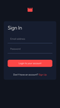
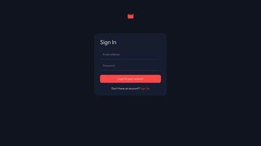
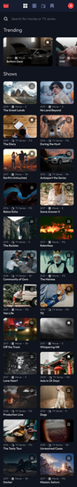
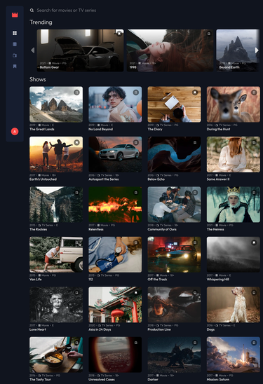

# Frontend Mentor - Entertainment web app solution

This is a solution to the [Entertainment web app challenge on Frontend Mentor](https://www.frontendmentor.io/challenges/entertainment-web-app-J-UhgAW1X). Frontend Mentor challenges help you improve your coding skills by building realistic project.

## Table of contents

- [Overview](#overview)
  - [The challenge](#the-challenge)
  - [Screenshot](#screenshot)
  - [Links](#links)
  - [Setup](#setup)
- [My process](#my-process)
  - [Built with](#built-with)

## Overview

### The challenge

Users should be able to:

- [x] View the optimal layout for the app depending on their device's screen size
- [x] See hover states for all interactive elements on the page
- [x] Navigate between Home, Movies, TV Series, and Bookmarked Shows pages
- [x] Add/Remove bookmarks from all movies and TV series
- [x] Search for relevant shows on all pages
- [x] **Bonus**: Build this project as a full-stack application
- [x] **Bonus**: If you're building a full-stack app, we provide authentication screen (sign-up/login) designs if you'd like to create an auth flow

### Screenshots

| Mobile layout                                                                                     | Desktop layout                                                                                      |
| ------------------------------------------------------------------------------------------------- | --------------------------------------------------------------------------------------------------- |
| <a href="./screenshots/mobile-signin.png"></a> | <a href="./screenshots/desktop-signin.png"></a> |
| <a href="./screenshots/mobile-main.png"></a>     | <a href="./screenshots/desktop-main.png"></a>    |

### Links

- Live Site URL: https://frontend-mentor-entertainment-app-neon.vercel.app

### Setup

Install dependencies:

```
npm install
```

Create a `.env` file in the root of the poject directory and add the following variables:

```
NEXTAUTH_URL="<Website url>"
NEXTAUTH_SECRET="<Secret value for next-auth>"
TURSO_DATABASE_URL="<Turso database url>"
TURSO_AUTH_TOKEN="<turso database auth token>"
```

Example `.env` file:

```
NEXTAUTH_URL="localhost:3000"
NEXTAUTH_SECRET="apDXOcvgjU6RB9ZVA0dhGxnEEg6iotMwHSBl2kfWgBk="
TURSO_DATABASE_URL="libsql://example.turso.io"
TURSO_AUTH_TOKEN="abcde"
```

#### Apply database migrations

In a terminal, run:

```
drizzle-kit generate:sqlite
drizzle-kit push:sqlite
```

### Runing in dev mode

In a terminal, run:

```
npm run dev
```

## My process

### Built with

- CSS custom properties
- Flexbox
- CSS Grid
- Mobile-first workflow
- [Sass](https://sass-lang.com/) - CSS preprocessor
- [React](https://reactjs.org/) - JS library
- [Typescript](https://www.typescriptlang.org/) - JavaScript with syntax for types
- [Next.js 14](https://nextjs.org/) - React framework
- [NextAuth.js](https://next-auth.js.org/) - Authentication library
- [next-intl](https://next-intl-docs.vercel.app/) - Internationalization library
- [Drizzle](https://orm.drizzle.team/) - Database ORM
- [Turso](https://turso.tech/) - libSQL database
